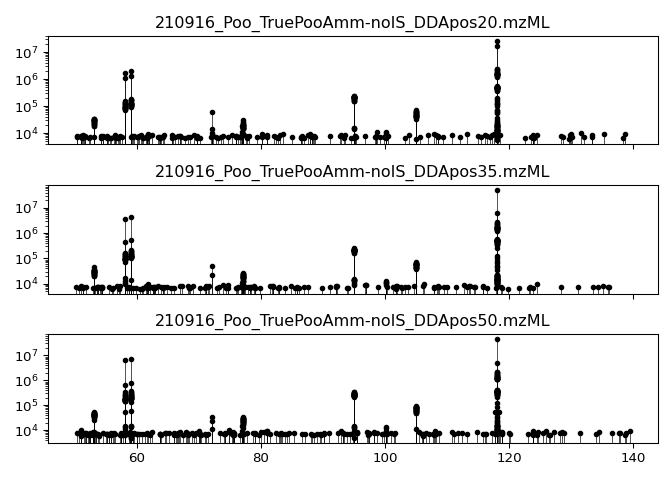
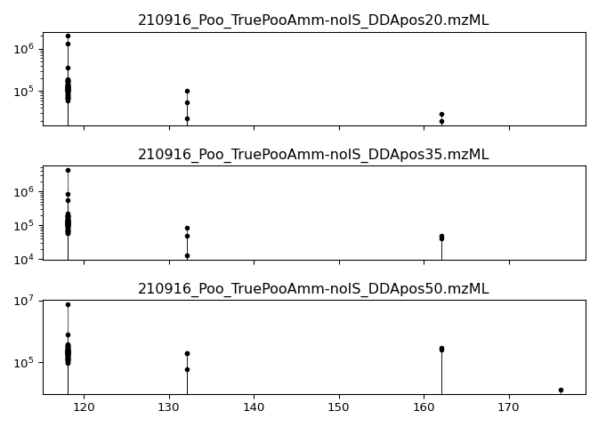

# The mzsql project


This repository implements “vanilla” SQL databases for the efficient
storage and access of raw mass-spectrometry (MS) data. Here, “raw” MS
data refers to the data encoded in vendor or .mzML files and contains
coordinates of retention time, m/z ratio, and intensity.


Existing data formats fail to provide intuitive, rapid, and programmatic
search of raw MS data and require learning the quirks and conceits of
idiosyncratic file formats. Databases have consistent and transferrable
syntax for queries, indexing and binary search for rapid data
extraction, benefit from multi-file aggregations of data, can store
processed data alongside, and are established as an industry standard.


*Comparison of existing MS file types in query timing and size on disk.
Six different queries were tried here: extracting an MS1 or MS2 scan (A
and D), a chromatogram (B), all data points within a retention time
range (C), or fragment/precursor data (E and F). Thirteen different
parsers were implemented in Python for this comparison, visible in the
manuscript_things branch of this repository.*

## Convert mzML files into a database via the converters above

Converters from mzML to SQLite and DuckDB are currently available in the
[converters folder](converters) for R with Python, Julia, and C++
hopefully soon. Code from the associated script can be directly copied
and pasted into your workflow, though you’re responsible for managing
the dependency installations.

### Convert from mzML to DuckDB using R:

Some simple demo code shown below for MS1 and MS2 table creation to
illustrate what the converters do:

``` r
# Ensure `RaMS`, `DBI`, and `duckdb`/`RSQLite` are all installed from CRAN.
library(RaMS)
msdata <- grabMSdata(list.files("demo_data", pattern = "mzML", full.names = TRUE))

library(DBI)
conn <- dbConnect(RSQLite::SQLite(), "demo_data/msdata.sqlite")
# conn <- dbConnect(duckdb::duckdb(), "demo_data/msdata.duckdb")
dbWriteTable(conn, "MS1", msdata$MS1)
dbWriteTable(conn, "MS2", msdata$MS2)
dbDisconnect(conn)
```

## Access the database using SQL

SQL is increasingly popular among mass spectrometrists and is consistent
between programming languages.

### Extract a chromatogram

General query: `SELECT * FROM MS1 WHERE mz BETWEEN mzmin AND mzmax`

<details open>
<summary>
R code
</summary>

Ensure `DBI`, and `RSQLite`/`duckdb` are all installed from CRAN.

``` r
library(DBI)
pmppm <- function(mass, ppm)c(mass * (1 - ppm/1e+06), mass * (1 + ppm/1e+06))

conn <- dbConnect(RSQLite::SQLite(), "demo_data/msdata.sqlite")
# conn <- dbConnect(duckdb::duckdb(), "demo_data/msdata.duckdb")
chr_statement <- "SELECT * FROM MS1 WHERE mz BETWEEN ? AND ? ORDER BY filename, rt"
chrom <- dbGetQuery(conn, chr_statement, params=pmppm(118.0865, 10))
dbDisconnect(conn)
plot(chrom$rt, chrom$int, type = "l")
```


</details>
<details>
<summary>
Python
</summary>

Make sure the duckdb/sqlite and matplotlib packages are installed.

``` python
import duckdb
def pmppm(mz, ppm):
  return(mz*(1-ppm/1000000), mz*(1+ppm/1000000))

conn = duckdb.connect("demo_data/msdata.duckdb")
chr_statement = "SELECT * FROM MS1 WHERE mz BETWEEN ? AND ?"
chrom = conn.execute(chr_statement, pmppm(118.0865, 10)).fetchdf()
conn.close()

import matplotlib.pyplot as plt
plt.plot(chrom["rt"], chrom["int"])
plt.show()
```


</details>
<details>
<summary>
Julia
</summary>

Make sure the SQLite/DuckDB, DataFrames, DBInterface, and Plots packages
are installed.

``` julia
using DuckDB, DataFrames, Plots;
pmppm(mass, ppm) = [mass * (1 - ppm / 1e6), mass * (1 + ppm / 1e6)];

conn = DBInterface.connect(DuckDB.DB, "demo_data/msdata.duckdb");
chr_statement = "SELECT * FROM MS1 WHERE mz BETWEEN ? AND ?";
chrom = DataFrame(DBInterface.execute(conn, chr_statement, pmppm(118.0865, 10)));
DBInterface.close!(conn)

plot(chrom.rt, chrom.int, lw=2)
```


</details>

### Search for fragments of a specific precursor

General query: `SELECT * FROM MS2 WHERE premz BETWEEN mzmin AND mzmax`

<details open>
<summary>
R code
</summary>

Ensure `DBI`, `ggplot2`, and `RSQLite`/`duckdb` are all installed from
CRAN.

``` r
library(DBI)
pmppm <- function(mass, ppm)c(mass * (1 - ppm/1e+06), mass * (1 + ppm/1e+06))

conn <- dbConnect(RSQLite::SQLite(), "demo_data/msdata.sqlite")
# conn <- dbConnect(duckdb::duckdb(), "demo_data/msdata.duckdb")
frag_statement <- "SELECT * FROM MS2 WHERE premz BETWEEN ? AND ?"
frag_data <- dbGetQuery(conn, frag_statement, params=pmppm(118.0865, 10))
dbDisconnect(conn)

library(ggplot2)
ggplot(frag_data, aes(x=fragmz, y=int)) +
  geom_point() +
  geom_segment(aes(xend=fragmz, yend=0)) +
  facet_wrap(~filename, ncol=1) +
  scale_y_log10()
```


</details>
<details>
<summary>
Python
</summary>

Make sure the duckdb and matplotlib packages are installed.

``` python
import duckdb
import matplotlib.pyplot as plt
def pmppm(mz, ppm):
  return(mz*(1-ppm/1000000), mz*(1+ppm/1000000))

conn = duckdb.connect("demo_data/msdata.duckdb")
frag_statement = "SELECT * FROM MS2 WHERE premz BETWEEN ? AND ?"
frag_data = conn.execute(frag_statement, pmppm(118.0865, 10)).fetchdf()
fig, axes = plt.subplots(3, 1, sharex=True)
for ax, filename in zip(axes, frag_data["filename"].unique()):
    subset = frag_data[frag_data["filename"] == filename]
    ax.vlines(subset["fragmz"], 0, subset["int"], color='k', zorder=1, linewidths=0.5)
    ax.scatter(subset["fragmz"], subset["int"], color='k', zorder=2, s=10)
    ax.set_yscale("log")
    ax.set_title(filename)
conn.close()

plt.tight_layout()
plt.show()
```



</details>
<details>
<summary>
Julia
</summary>

Make sure the SQLite/DuckDB, DataFrames, DBInterface, and StatsPlots
packages are installed.

``` julia
using DuckDB, DataFrames, StatsPlots;
pmppm(mass, ppm) = [mass * (1 - ppm / 1e6), mass * (1 + ppm / 1e6)];

conn = DBInterface.connect(DuckDB.DB, "demo_data/msdata.duckdb");
frag_statement = "SELECT * FROM MS2 WHERE premz BETWEEN ? AND ?";
frag_data = DataFrame(DBInterface.execute(conn, frag_statement, pmppm(118.0865, 10)));
DBInterface.close!(conn)

@df frag_data scatter(:fragmz, :int, markersize=3, group=:filename, yscale=:log10)
```


``` julia
# @df frag_data plot!([:fragmz :fragmz]', [zeros(size(frag_data, 1)) frag_data.int]', lw=1, group=:filename)
```

</details>

### Search for precursors of a specific fragment

General query: `SELECT * FROM MS2 WHERE fragmz BETWEEN mzmin AND mzmax`

<details open>
<summary>
R code
</summary>

Ensure `DBI`, `ggplot2`, and `duckdb` are all installed from CRAN.

``` r
library(DBI)
pmppm <- function(mass, ppm)c(mass * (1 - ppm/1e+06), mass * (1 + ppm/1e+06))

conn <- dbConnect(RSQLite::SQLite(), "demo_data/msdata.sqlite")
# conn <- dbConnect(duckdb::duckdb(), "demo_data/msdata.duckdb")
pre_statement <- "SELECT * FROM MS2 WHERE fragmz BETWEEN ? AND ?"
pre_data <- dbGetQuery(conn, pre_statement, params=pmppm(59.07336, 10))
dbDisconnect(conn)

library(ggplot2)
ggplot(pre_data, aes(x=premz, y=int)) +
  geom_point() +
  geom_segment(aes(xend=premz, yend=0)) +
  facet_wrap(~filename, ncol=1) +
  scale_y_log10()
```


</details>
<details>
<summary>
Python
</summary>

Make sure the duckdb and matplotlib packages are installed.

``` python
import duckdb
import matplotlib.pyplot as plt
def pmppm(mz, ppm):
  return(mz*(1-ppm/1000000), mz*(1+ppm/1000000))

conn = duckdb.connect("demo_data/msdata.duckdb")
pre_statement = "SELECT * FROM MS2 WHERE fragmz BETWEEN ? AND ?"
pre_data = conn.execute(pre_statement, pmppm(59.07336, 10)).fetchdf()
fig, axes = plt.subplots(3, 1, sharex=True)
for ax, filename in zip(axes, pre_data["filename"].unique()):
    subset = pre_data[pre_data["filename"] == filename]
    ax.vlines(subset["premz"], 0, subset["int"], color='k', zorder=1, linewidths=0.5)
    ax.scatter(subset["premz"], subset["int"], color='k', zorder=2, s=10)
    ax.set_yscale("log")
    ax.set_title(filename)
conn.close()
plt.tight_layout()
plt.show()
```



</details>
<details>
<summary>
Julia
</summary>

Make sure the SQLite/DuckDB, DataFrames, DBInterface, and StatsPlots
packages are installed.

``` julia
using DuckDB, DataFrames, StatsPlots;
pmppm(mass, ppm) = [mass * (1 - ppm / 1e6), mass * (1 + ppm / 1e6)];

conn = DBInterface.connect(DuckDB.DB, "demo_data/msdata.duckdb");
pre_statement = "SELECT * FROM MS2 WHERE fragmz BETWEEN ? AND ?";
pre_data = DataFrame(DBInterface.execute(conn, pre_statement, pmppm(59.07336, 10)));
DBInterface.close!(conn)

@df pre_data scatter(:premz, :int, markersize=3, group=:filename, yscale=:log10)
```


``` julia
# @df pre_data plot!([:premz :premz]', [zeros(size(pre_data, 1)) pre_data.int]', lw=1, group=:filename)
```

</details>

## Other README things

------------------------------------------------------------------------

README last built on 2025-03-19
