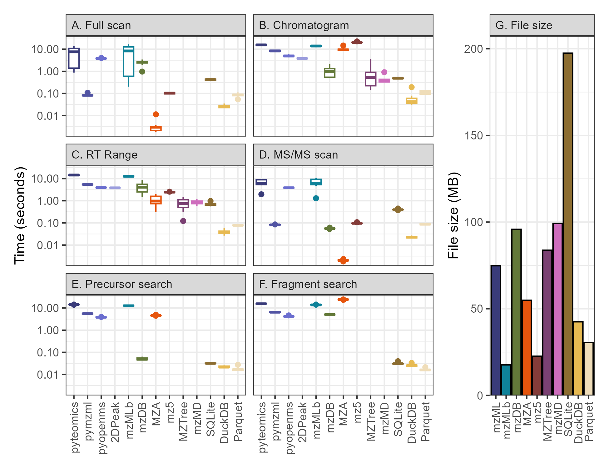
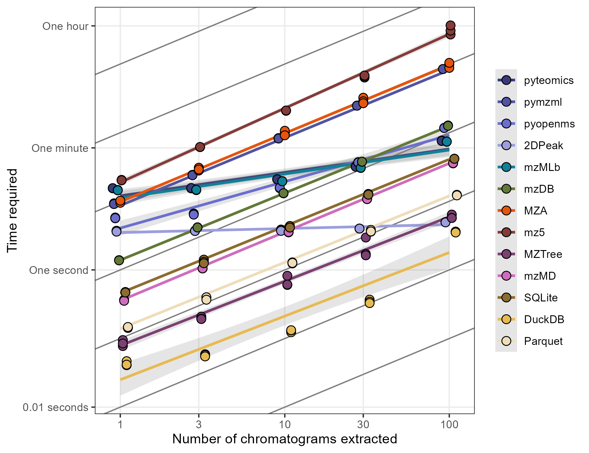
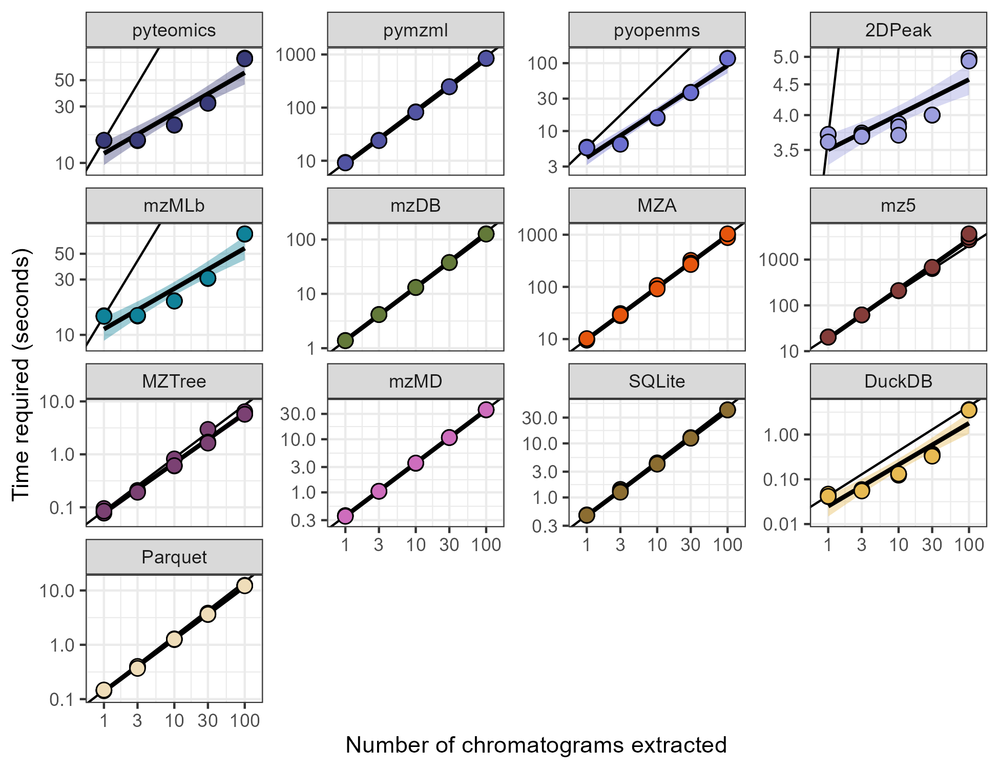
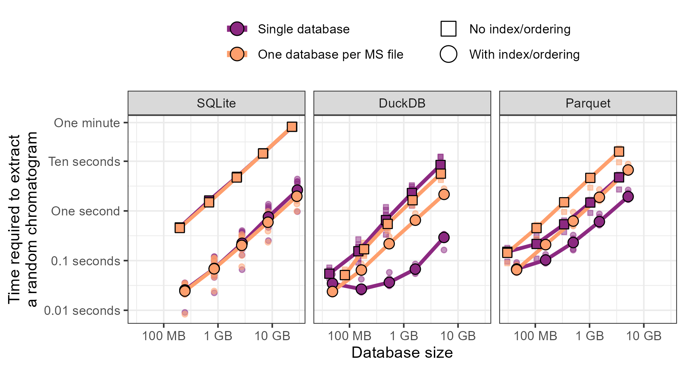

```{r setup, include=FALSE}
knitr::opts_chunk$set(echo = TRUE, include=FALSE, eval=FALSE)
library(tidyverse)
library(ggtext)
library(patchwork)

method_names <- c("pyteomics", "pymzml", "pyopenms", "pyopenms_2DPeak",
                  "mzMLb", "mzDB", "MZA", "mz5", 
                  "MZTree", "mzMD", 
                  "SQLite", "DuckDB", "Parquet")
method_colors <- c("#0B4F5B", "#147C8F", "#21A8C0", "#44C3DA", 
                   "#028e34", "#f4bb23", "#e0670b", "#a41118", 
                   "#E25C76", "#E891A2", 
                   "#580770", "#8A1BAC", "#B04ACF")

```

https://researcher-resources.acs.org/publish/author_guidelines?coden=jprobs

# Abstract

(200 words max)

# Introduction

Mass spectrometry (MS) still lacks a performant data access format. The mzML file type [@Martens2011], a result of over a decade of interlaboratory collaboration and workshopping, struggles to provide rapid computational access to the m/z and intensity tuples. This is the crucial component in nearly all mass spectrometry analysis, but mzML’s text-based XML format requires time-consuming decompression performed one scan at a time. This is largely due to its preservation of the scan as the unit of transaction while the field moves increasingly away from single-scan analysis [@Rost2014; @Ting2015].

As a result, alternative file formats are proposed practically every year. These include direct improvements to the mzML format with indexing [@Rost2015] and better internal encoding of the data [@Bhamber2021], HDF5-based alternatives [@Bhamber2021; @Wilhelm2012; @Bilbao2023; @Tully2020; @Askenazi2017], relational databases [@Shah2010; @Bouyssie2015; @Handy2017; @Yang2022; @Beagley2009], or fully custom alternatives [@Rompp2011; @Lu2022]. Fundamentally, these alternatives implement tradeoffs between user sanity in exchange for access speed and/or size on disk with clever compression algorithms and modern data structures that move away from the human-readable format of the mzML. These optimized formats are inherently more difficult to understand and usually lack comprehensive documentation or examples (particularly across programming languages) making it difficult for new users to enjoy their benefits or extend their functionality. This steep learning curve, coupled with a lack of support in conversion tools such as Proteowizard’s msconvert [@Chambers2012], has prevented widespread adoption of these new formats despite their clear computational advantages. Such formats are also fragile in the sense that without community support, their continued development depends entirely on the original developers and easily become deprecated (as is the case with YAFMS, Shaduf, and mz5, all of whom have links in their papers that currently redirect to missing webpages). A simple, speedy, and small MS data format remains very much in demand.

Relational databases are not new for MS workflows (see references above) and compete predominantly with HDF5-based methods. Both of these systems are widely used for big data and can be applied to MS data in a plethora of ways, leading to the proliferation of implementations we see today. Both backends provide excellent universality, larger-than-memory support, and rapid access to data, but HDF5-based systems excel at self-description and hierarchical structures [@Askenazi2017] while the relational database model is optimized for multi-table queries using a consistent syntax [@Codd1970]. Relational databases are increasingly seen in MS workflows for both raw and processed data, with SQLite backends now supported in the popular peakpicking software xcms [@Smith2006] via the Spectra package [@Rainer2022] (though in-memory and HDF5 options are also supported) and on MetabolomicsWorkbench [@Sud2016] while the development of MassQL [@Jarmusch2022] demonstrates the increasing comfort that MS analysts have with the adoption of SQL.

Relational databases also have several distinct advantages over hierarchical or text-based systems, particularly in performing searches for subsets of data via indices. Importantly, this indexing differs from the byte-offset indexes that already exist in the indexed mzML and HDF5 formats because the search for a particular subset cannot be done efficiently with a byte-offset index when the m/z data is encoded, though access to a particular scan can be incredibly rapid. Additionally, data from multiple samples can be stored together in a single table, differing from formats like mzDB, mzTree, and mzMD and allowing queries of all dataset samples to be performed without looping through each file in turn, thereby avoiding the associated computational overhead and query complexity. 

SQL databases also allow mass spectrometrists to access the continual improvements and long-term stability produced by the industries who specialize in these. While HDF5 is a common scientific data format, databases are constantly under development by industry titans deeply invested in their maintenance and optimization. Online analytical processing (OLAP) methods are particularly well suited for MS data given their optimization for read speed under the assumption of infrequent transactions, making modern systems such as DuckDB [@Raasveldt2019] or Apache's Parquet formats highly appealing while preserving the familiar file-based serverless approach.

Our previous work showed how the ragged arrays of MS data can be converted into a tidy database table in memory [@Kumler2022] and we now logically extend that method into proper database storage. Here, we test the hypothesis that a “vanilla” implementation of a relational database which exposes the raw m/z and intensity tuples is an intuitive and performant way of storing MS data for exploratory analysis, visualization, and quality control. We compare the time and space required to extract a representative data subset under six conditions and perform these tests on multiple databases as well as mzML and other MS data formats.

# Experimental section

We performed a literature search for mass-spectrometry data formats that have been published in the last 15 years and attempted to find or construct parsers for each format in Python, a popular high-level interpreted language. Each parser was written to perform three common exploratory data analysis operations on full-scan data and three common operations on MS/MS fragmentation data. Full scan queries consisted of 1) single scan extraction by scan number, 2) retention time range extraction of all scans within a specified retention time range, and 3) chromatogram extraction, which collects the ions within a specified parts-per-million (PPM) error of a known mass. These queries generally correspond to the methods used in @Bouyssie2015, which performed similar tests benchmarking the mzDB format against mz5 and an mzML parser. Note that the chromatogram extraction does not extract a precompiled chromatogram of the sort commonly found at the end of mzML files or as a result of SIM/PRM analysis but instead refers to sifting through the raw data for data tuples with an *m/z* value between specified bounds. MS/MS queries involved extracting three relevant subsets, consisting of 1) a single scan extraction by scan number similar to that of the full scan, 2) extraction of all the fragments associated with a precursor *m/z* within a given PPM, and 3) extraction of all fragments with *m/z* values within a given PPM.

We explored the available documentation on PyPI and Github for each mass spectrometry data format and either identified existing functions and packages that would perform the above queries or wrote our own functions if necessary.

## Mass-spectrometry files

We browsed Metabolights [@Haug2019] for suitable LCMS datasets, looking for studies that included 100+ gigabytes of data from both full scan and MS/MS analysis. We were also restricted to the Thermo Scientific .raw file format, as it was the most widely supported by alternative MS storage methods. We also excluded polarity-switching data as it is unclear whether all converters would be able to separate scans based on polarity.

Files were downloaded as .raw. mzML, mz5, and mzMLb were all natively supported by Proteowizard's `msconvert` software (version 3.0.25009) while MZA (v1.24.11.16) and mzDB (v0.9.10_build20170802) had separate extensions to this executable enabling their own conversion. MzTree and mzMD were converted via their GUI which did not have release or versioning information available but were downloaded from Github (https://github.com/optimusmoose/MZTree and https://github.com/yrm9837/mzMD-java, respectively) and built via Maven (v3.9.9) for Java (v21.0.6). SQL databases were built using Python 3.11.11 with SQLite (v3.48.0) via the Python sqlite3 package (v2.6.0), DuckDB via the duckdb package (v1.1.3), and Parquet files via the pyarrow package (v19.0.0). We were additionally able to download and install []

mzML access was done with Python's pyteomics package (v4.7.5), the pymzml package (v2.5.10), and the pyopenms package (3.0.0.dev20230306). MZA files were accessed via the mzapy library (v1.8.dev4 from the no_full_mz_array branch on Github) and via custom code built around the h5py package (3.12.1). Custom parsers were required for mzDB, mz5, MzTree, and mzMD.

```{shell, eval=FALSE}
cd Documents\Will
git clone https://github.com/wkumler/mzsql
cd mzsql

conda create -n "mzsql_3_11" python=3.11 numpy=1.26.4
pip install https://pypi.cs.uni-tuebingen.de/packages/pyopenms-3.0.0.dev20230306-cp311-cp311-win_amd64.whl#md5=cdce650718bea07a0193b3227a2c075b
conda activate mzsql_3_11
pip install -e .
pip install git+https://github.com/PNNL-m-q/mzapy.git@no_full_mz_array#egg=mzapy

cd java_things
curl -O https://dlcdn.apache.org/maven/maven-3/3.9.9/binaries/apache-maven-3.9.9-bin.zip
tar -xf apache-maven-3.9.9-bin.zip
git clone https://github.com/optimusmoose/MZTree.git
cd MZTree
cd msDataServer
C:\Users\willi\Documents\mzsql\java_things\apache-maven-3.9.9\bin\mvn package
java -Dsun.java2d.d3d=false -Dsun.java2d.opengl=false -jar java_things\MZTree\msDataServer\target\msDataServer-1.0.jar
(manually) open mztree file in port 4568 (20220923_LEAP-POS_QC04.mzTree)


git clone https://github.com/yrm9837/mzMD-java.git
cd mzMD-java
C:\Users\willi\Documents\mzsql\java_things\apache-maven-3.9.9\bin\mvn package
java -Dsun.java2d.d3d=false -Dsun.java2d.opengl=false -jar java_things\mzMD-java\target\msDataServer-1.0.jar
(manually) open mzmd file in port 4567 (20220923_LEAP-POS_QC04.mzMD)


E:
cd mzsql\MTBLS10066

# After adding msconvert, raw2mzdb, and mza executables to PATH:
msconvert 20220923_LEAP-POS_QC04.raw --filter "peakPicking true 1-"
msconvert 20220923_LEAP-POS_QC04.raw --mzMLb --filter "peakPicking true 1-"
msconvert 20220923_LEAP-POS_QC04.raw --mz5 --filter "peakPicking true 1-"
# Needs full path or it crashes on startup?
"C:\Program Files\ProteoWizard\raw2mzDB_0.9.10_build20170802\raw2mzDB.exe" -i 20220923_LEAP-POS_QC04.raw  -c 1-2 --safeMode
mza -file 20220923_LEAP-POS_QC04.raw
```

## Database schema

The “vanilla” database style proposed here abandons a 1:1 representation of the original vendor-specific file. This decision was made after discussion with a wide variety of experts, all of whom preserved the original MS files even after conversion to another file type, indicating that a highly-performant addition is more important than direct replacement. Here, we map MS concepts (retention time, *m/z*, intensity, etc.) directly to database fields to make downstream processing as intuitive as possible. Metadata is stored separately in `file_info` and `scan_info` tables that are linked by filename and scan number (Figure XX). We do not force compression of any of these fields because we believe that decoding compressed data is both a slow and unintuitive step, though automatic compression is supplied by the DuckDB and Parquet file types.

```{r gtables for figure 1}
library(gt)
data.frame(
  filename=c("Smp_A", "Smp_B", "Smp_Y", "Smp_Z"),
  n_scans=c(1445, 1489, 1388, 1390),
  timestamp=c("2021-08-23 04:30", "2021-08-23 05:25", "2021-08-23 22:15", "2021-08-23 23:10"),
  `etc.`=c("...", "...", "...", "...")
) %>%
  gt() %>%
  cols_label(filename=html("filename</br><small>Source file</small>"),
             n_scans=html("n_scans</br><small>Scan count</small>"),
             timestamp=html("timestamp</br><small>Timestamp</small>"),
             `etc.`=html("Etc.</br><small>...</small>")) %>%
  tab_row_group(label = "...additional samples...", rows = !c(TRUE, TRUE, FALSE, FALSE)) %>%
  tab_row_group(label = "", rows = c(TRUE, TRUE, FALSE, FALSE)) %>%
  tab_style(style = cell_text(align = "center"), locations = cells_row_groups()) %>%
  opt_table_outline() %>%
  tab_style(cell_borders(sides = c("left", "right")), locations = cells_body()) %>%
  cols_align(align = "center") %>%
  cols_move_to_start("filename") %>%
  tab_options(row_group.padding = 3) %>%
  tab_header(title = "Table: file_info") %>%
  tab_style(style = cell_text(align = "left"), locations = cells_title()) %>%
  gtsave(filename = "figures/fileinfo_table.png", vwidth=1000)

data.frame(
  filename=c("Smp_A", "Smp_A", "Smp_Z", "Smp_Z"),
  scan_num=c(1, 2, 1389, 1390),
  ms_level=c(1, 2, 2, 2),
  rt=c(0.10, 0.12, 22.43, 22.45),
  # min_mz=c(59.99975, 49.99992, 50.00013, 49.99978),
  TIC=c(2331809, 820427, 9555703, 1892338),
  `etc.`=c("...", "...", "...", "...")
) %>%
  gt() %>%
  cols_label(filename=html("filename</br><small>Source file</small>"),
             scan_num=html("scan_num</br><small>Scan number</small>"),
             ms_level=html("ms_level</br><small>MS level</small>"),
             rt=html("rt</br><small>Retention time</small>"), 
             # min_mz=html("min_mz</br><small>Lowest <emph>m/z</emph></small>"),
             TIC=html("TIC</br><small>Ion current</small>"),
             `etc.`=html("Etc.</br><small>...</small>")) %>%
  tab_row_group(label = "...many additional scans...", rows = !c(TRUE, TRUE, FALSE, FALSE)) %>%
  tab_row_group(label = "", rows = c(TRUE, TRUE, FALSE, FALSE)) %>%
  tab_style(style = cell_text(align = "center"), locations = cells_row_groups()) %>%
  opt_table_outline() %>%
  tab_style(cell_borders(sides = c("left", "right")), locations = cells_body()) %>%
  cols_align(align = "center") %>%
  cols_move_to_start("filename") %>%
  tab_options(row_group.padding = 3) %>%
  tab_header(title = "Table: scan_info") %>%
  tab_style(style = cell_text(align = "left"), locations = cells_title()) %>%
  gtsave(filename = "figures/scaninfo_table.png", vwidth=1000)


data.frame(
  filename=c("Smp_A", "Smp_A", "Smp_Z", "Smp_Z"),
  scan_num=c(1,1,1385,1385),
  rt=c(0.10, 0.10, 22.35, 22.35),
  mz=c(60.0452, 60.0532, 60.0456, 60.0531),
  int=c(6618, 2657, 158084, 4673)
) %>%
  gt() %>%
  cols_label(filename=html("filename</br><small>Source file</small>"),
             scan_num=html("scan_num</br><small>Scan number</small>"),
             rt=html("rt</br><small>Retention time</small>"), 
             mz=html("mz</br><small><emph>m/z</emph> ratio</small>"), 
             int=html("int</br><small>Intensity</small>")) %>%
  tab_row_group(label = "...millions of additional entries...", rows = rt>=mean(rt)) %>%
  tab_row_group(label = "", rows = rt<=mean(rt)) %>%
  tab_style(style = cell_text(align = "center"), locations = cells_row_groups()) %>%
  opt_table_outline() %>%
  tab_style(cell_borders(sides = c("left", "right")), locations = cells_body()) %>%
  cols_align(align = "center") %>%
  cols_move_to_start("filename") %>%
  tab_options(row_group.padding = 3) %>%
  tab_header(title = "Table: MS1") %>%
  tab_style(style = cell_text(align = "left"), locations = cells_title()) %>%
  gtsave(filename = "figures/ms1_table.png", vwidth=1000)

data.frame(
  filename=c("Smp_A", "Smp_A", "Smp_Z", "Smp_Z"),
  scan_num=c(2,2,1390,1390),
  prescan=c(1,1,1385,1385),
  ms2_rt=c(0.12, 0.12, 22.45, 22.45),
  fragmz=c(51.0238, 53.0394, 52.0186, 57.0923),
  premz=c(241.0894, 241.0894, 185.1932, 185.1932),
  ms2_int=c(36104, 243165, 28371, 129604)
) %>%
  gt() %>%
  cols_label(filename=html("filename</br><small>Source file</small>"),
             scan_num=html("scan_num</br><small>Scan number</small>"),
             prescan=html("prescan</br><small>Precursor scan</small>"),
             ms2_rt=html("rt</br><small>Retention time</small>"), 
             fragmz=html("fragmz</br><small>Fragment <emph>m/z</emph></small>"), 
             premz=html("premz</br><small>Precursor <emph>m/z</emph></small>"), 
             ms2_int=html("int</br><small>Intensity</small>")) %>%
  tab_row_group(label = "...millions of additional entries...", rows = ms2_rt>=mean(ms2_rt)) %>%
  tab_row_group(label = "", rows = ms2_rt<=mean(ms2_rt)) %>%
  tab_style(style = cell_text(align = "center"), locations = cells_row_groups()) %>%
  opt_table_outline() %>%
  tab_style(cell_borders(sides = c("left", "right")), locations = cells_body()) %>%
  cols_align(align = "center") %>%
  cols_move_to_start("filename") %>%
  tab_options(row_group.padding = 3) %>%
  tab_header(title = "Table: MS2") %>%
  tab_style(style = cell_text(align = "left"), locations = cells_title()) %>%
  gtsave(filename = "figures/ms2_table.png", vwidth=1000)
```


*Figure XX: Database schema for an example MS/MS dataset showing the organization of mass-spectrometry data into tables. Fields of interest are easily queryable with simple SQL commands as shown in the table at bottom.*

## Time and space testing

[TODO: Note the method used to identify the m/zs, scans, and RT ranges extracted here]

Via %timeit% (need to redo these with randomization)


# Results

We settled on a large dataset of gut microbiota LC-MS files published in @Portlock2025 and available on Metabolights under accession number MTBLS10066.

## All existing MS data formats demand a high level of domain knowledge

We were able to obtain or write parsers for seven different existing mass spectrometry (MS) data formats: mzML, mzMLb, mz5, mzDB, MZA, MzTree, and mzMD. Multiple Python packages existed for the mzML data format so we used each of the three dominant packages (pyteomics, pyOpenMS, and pymzml) and compared their timing results as well. We failed to produce parsers for the YAFMS and Shaduf file types due to complete deprecation (links to these no longer exist), the toffee file type due to its application solely to time-of-flight (TOF) data-independent acquisition (DIA) data, the Aird file type due to its current deprecation in Python and C#, and the UIMF format due to a complete lack of interface documentation.

### File conversion support varied enormously

Conversion from the initial Thermo .raw file type to the open-source .mzML format was seamlessly performed by Proteowizard's `msconvert` library. Similarly, Proteowizard support for the .mz5 and .mzMLb file types made their conversion trivial.

mzDB and MZA both had reasonably good documentation, both formats notably providing self-contained extensions to `msconvert` for ease of conversion. However, both converters provide limited coverage, with mzDB notably missing support for Waters and Agilent .d files while MZA currently lacks support for AB Sciex .wiff and Bruker .baf files. Both converters are only available via binary executable (.exe), restricting their use to Windows platforms. Additionally, both parsers appear to be unable to separate scans from a polarity-switching experiment or support any of the other filters available natively in `msconvert`, as additional arguments passed to the executable throw errors instead of being passed along to the original software.

MZTree and its derivative, mzMD, provided significantly less documentation about the conversion process than the other file types. This documentation consisted solely of the README available in the associated Github repositories and their installation and deployment required rebuilding the Java applet, of which the bare-bones instructions make several assumptions about the user's PATH environmental variable. In the case of mzMD, no documentation for installation and build was provided and this instead needed to be deduced from MZTree. Additionally, we ran into issues with hardware acceleration once the GUI was launched that required extensive debugging. The GUI conversion, however, is straightforward once the app is correctly compiled and launched, albeit requiring a manual entry of a single file at a time with no apparent batch processing available.

The Aird file type was straightforward to convert on Windows via the executable available on Github (v6.0.0) but does not seem to be available for other operating systems, much like MZA and mzDB. Unfortunately the Python package designed to allow an interface to the file type has been deprecated and we were unable to install or use it in a meaningful way and were unable to reverse-engineer the file type sufficiently to compare it here. The UIMF file type from the Pacific Northwest National Lab (PNNL) provided documentation exclusively in the form of C# commands and did not supply instructions for file conversion, making it unclear what input formats were supported. The toffee format also provided zero documentation for conversion from other formats and was restricted to time-of-flight (TOF) data independent acquisition (DIA) MS data. Thus, we were unable to directly compare any of these three file types to the others.

### Universal lack of support for the six relevant queries

Despite the relative simplicity and relevance of our queries, none of the available mass spectrometry (MS) formats had existing functions or documented examples of all six queries. Unsurprisingly, the mzML file type had the most extensive coverage but documentation and prebuilt functionality was still disappointingly sparse. The pyteomics package provides four "combined examples" that focus on the spectrum visualization and annotation common to proteomics research but provide minimal guidance about chromatogram or retention time range extraction. pyteomics also provides native support for the mzMLb file type and was the only one of the three Python packages to do so, deserving praise for the minimal disruption that mzMLb files placed on existing pipelines if they were to switch from mzML to mzMLb. The pyopenms package provides similarly extensive documentation for proteomic and scan-based analysis but again lacks information about subsetting in the retention time direction, though the existence of an undocumented parser (`get2DPeakDataLong`) provides a simple way to do this for MS<sup>1</sup> data. Additionally, pyOpenMS required installing an old version of the package (3.0.0), Python itself (3.11) and the numpy package (<2.0) due to more recent builds requiring AVX support which was unavailable on our hardware. pymzml is intentionally a lightweight parser focused exclusively on reading mzML files but does not supply any functions for the queries other than scan extraction by number and the "Spectrum and Chromatogram" documentation module was empty at the time of writing (February 2025).

mz5's documentation was remarkably sparse, especially considering it was one of the earliest mzML formats and is supported by Proteowizard. Crucially, the original paper [@Wilhelm2012] contains links to a website (https://software.steenlab.org/mz5) which currently returns an HTTP error 500. A Python library (pymz5) exists but requires an old version of Python (2.7 or 3.2) and hasn't been updated in 12 years and is predominately a simple fork of h5py [@ref] with three mz5-specific commits on top. Most problematically, we were unable to determine how mz5 stores precursor *m/z* ratios, making the fragment and precursor searches impossible. This was largely due to the variable-length nested compound structures mz5 that are not supported in all APIs, e.g. Java (@Bhamber2021).

mzDB access was hamstrung by several issues, primarily the outdated repository that implies Python and R support via a port from Rust but was unavailable at the time of development, though we are grateful for the responsive developer who notified us that this implementation was not feature-complete. This required that we deduce the SQLite BLOB type compression format from scratch when writing a parser and spend extensive time reading through the documentation to determine how best to link the various tables provided in the mzDB file. Scan metadata in this file type is stored as raw XML strings, producing the worst of both worlds in requiring both SQLite knowledge in their extraction and XML processing to obtain the relevant information. Additionally, its failure to implement the clever bounding box and run slice scheme for MS/MS data negated with our ability to avoid parsing every MS/MS spectrum when performing precursor and fragment searches.

MZA provides a complementary Python package, `mzapy`, for access to MZA files. Here again we ran into several issues with its installation and use stemming largely from the deployed package requiring TOF bins for parsing, though a separate Github branch provides a workaround and the rapid developer response was appreciated. The `mzapy` package provides a clear example of chromatogram extraction as well as a method for retention time range extraction, though there exists no clear function for the extraction of a single spectrum by scan number despite the internal file structure being highly optimized for this purpose. `mzapy` also provides good support for ion mobility extraction but fails to index MS/MS information or provide any clear way to extract fragments by *m/z* or precursor.

MZTree and mzMD provide a slightly strange interface to MS data, requiring a separate Java server that is then be queried via an HTTP API. For users without prior knowledge of HTTP request methods or exposure to programming APIs, the README is entirely unhelpful because it simply documents the API's endpoints and provides no complete query strings as examples to guide the user. This combination of GUI server and command-line HTTP request inverts the typical paradigm of GUI for exploration and command line for construction to convoluted effect, though the structure of the data returned by the server is impressively simple. More problematically for this analysis, the API provides no apparent way to access MS/MS data or query the files by scan number, with only RT and *m/z* bounds controlling the subset of data extracted. Finally, the GUI provides no way to open multiple files simultaneously or iterate through files programmatically and instead requiring point-and-click interaction with the GUI each time a file is opened or closed, preventing us from making reasonable comparisons in tests requiring multiple files.

## SQL-based parsers were simple to write and use

We then used custom code to convert the mzML files into SQLite and DuckDB databases using a simple schema for MS1 and MS2 data. The MS1 table consisted simply of fields for filename, scan index, retention time, *m/z* ratio, and intensity. The MS2 table consisted of the same fields except that the *m/z* column was separated into precursor and fragment *m/z*. Although we did not extend these databases to include the metadata associated with each file and scan, the logical framework could be easily extended in future work and the metadata typically represents a small fraction of the total space within the file, allowing us to make reasonable comparisons about file size between the databases and the metadata-rich other file types. We also converted each file's MS1 and MS2 table into Parquet representations for comparison using the same field/column schema.

We found that the documentation for SQLite, DuckDB, and Parquet file formats in Python far exceeded the documentation available for any mzML parser. This is unsurprising given that these file formats are used widely outside of MS research and are developed and maintained by dedicated teams. Additionally, the use of a consistent SQL syntax for table creation and insertion meant that the same code could be used to write to both SQLite and DuckDB, as well as any other databases supported in Python. The use of packages such as SQLAlchemy could be used to additionally streamline this process to any additional database by simply swapping in a new database engine.

Querying the MS1 and MS2 tables was also very straightforward. After establishing a connection to the database, the six queries could be asked using nearly human-readable SQL syntax. Requesting the thousandth MS1 scan by number consisted simply of `SELECT * FROM MS1 WHERE id = 1000` passed along to the `pandas.read_sql_query` function. More complicated queries such as retention time range (`SELECT * FROM MS1 WHERE rt BETWEEN 6 AND 8`) and a precursor mass search (`SELECT * FROM MS2 WHERE premz BETWEEN 118.086 AND 118.087`) were similarly intuitive.

## Time and space requirements for a single DDA file across formats

```{r singlefile_fig}
all_timings <- read_csv("data/singlefile_times.csv") %>% 
  mutate(method=factor(method, levels=method_names)) %>%
  mutate(query=factor(query, levels=c("ms1_spec", "chrom", "rtrange",
                                      "ms2_spec", "premz", "fragmz"),
                      labels=c("MS1 scan", "Chromatogram", "RT Range",
                               "MS2 scan", "Precursor search",
                               "Fragment search")))
all_sizes <- read_csv("data/file_sizes.csv") %>%
  mutate(method=factor(method, levels=method_names))

time_boxplot <- all_timings %>%
  ggplot() +
  geom_boxplot(aes(x=method, y=time, color=method)) +
  facet_wrap(~query) +
  scale_y_log10() +
  scale_color_manual(breaks = method_names, values=method_colors) +
  labs(x=NULL, y="Time (seconds)", color=NULL) +
  theme_bw() +
  theme(axis.text.x = element_text(angle=90, hjust=1, vjust=0.5),
        legend.position = "none")
size_barplot <- all_sizes %>%
  filter(!method%in%c("pyteomics", "pyopenms", "pyopenms_2DPeak")) %>%
  mutate(method=as.character(method)) %>%
  mutate(method=ifelse(method=="pymzml", "mzML", method)) %>%
  mutate(method=factor(method, levels=c("mzML", method_names))) %>%
  mutate(query="File size") %>%
  ggplot() +
  geom_hline(yintercept = 0) +
  geom_col(aes(x=method, y=file_size/1e6, fill=method), color="black") +
  scale_y_continuous(expand = expansion(mult = c(0, 0.05))) +
  scale_fill_manual(breaks = c("mzML", method_names), 
                    values=c("#147C8F", method_colors)) +
  facet_wrap(~query) +
  labs(x=NULL, y="File size (MB)", fill="File type") +
  theme_bw() +
  theme(axis.text.x = element_text(angle=90, hjust=1, vjust=0.5), legend.position = "none")

time_boxplot + size_barplot + plot_layout(widths = c(3.5, 1))

ggsave("figures/singlefile_fig.png", width = 6.5, height=5)

```



*Figure XX: Query time for the six data extraction methods and the associated file sizes for all 13 methods explored in this paper. The left six panels show boxplots representing the time required in seconds to extract an MS1 scan, an ion chromatogram, all data within a retention time range, an MS2 scan, the fragments of a specified precursor, and all precursors with a specified fragment. The error in the boxplot is composed of timing information for 10 repeated queries, each of a different target scan number, retention time (RT), or m/z. The right panel shows a barplot of the size on disk in megabytes (MB) occupied by each file type.*

```{r singlefile_supp}
fun_levels = c("<span style='color:#a41118'>Including initial load</span>", 
               "<span style='color:#0b505c'>Extraction only</span>")
init_outside_gp <- read_csv("data/singlefile_supp.csv") %>%
  pivot_longer(pyteomics:mz5, names_to = "method", values_to="time") %>%
  mutate(method=factor(method, levels=method_names)) %>%
  mutate(fun_type=factor(fun_type, levels=c("inclusive", "minimal"),
                         labels=fun_levels)) %>%
  ggplot() +
  geom_boxplot(aes(x=method, y=time, color=fun_type)) +
  scale_y_log10() +
  scale_color_manual(breaks=fun_levels, values = c("#a41118", "#0b505c")) +
  labs(x=NULL, y="Time (seconds)", color=NULL) +
  theme_bw() +
  theme(legend.text=element_markdown(), legend.position = "inside",
        legend.justification.inside = c(0.98, 0.95),
        legend.background = element_rect(color='black'),
        plot.title.position = "plot", 
        plot.caption.position =  "plot") +
  ggtitle("A) Scan extraction with and without pre-loading")

pyopenms_precomp_gp <- read_csv("data/pyopenms_precomp.csv") %>%
  pivot_longer(rep1:rep3) %>%
  mutate(type=factor(type, levels=c("init", "precomp"),
                       labels=fun_levels)) %>%
  mutate(method=factor(method, levels=c("spec", "chrom", "chrom_2D", "rtrange",
                                        "rtrange_2D", "premz", "fragmz"),
                       labels = c("Spectrum", "EIC", "EIC\n(2D Peak method)",
                                  "RT Range", "RT Range\n(2D Peak method)",
                                  "Precursor\nsearch", "Fragment\nsearch"))) %>%
  ggplot() +
  geom_boxplot(aes(x=method, y=value, color=type)) +
  scale_y_log10() +
  scale_color_manual(breaks=fun_levels, values = c("#a41118", "#0b505c")) +
  theme_bw() +
  theme(legend.position = "none", 
        plot.title.position = "plot", 
        plot.caption.position =  "plot") +
  labs(x=NULL, y="Time (seconds)", color=NULL) +
  ggtitle("B) pyopenms metric timings with and without pre-loading")

init_outside_gp / pyopenms_precomp_gp
ggsave("figures/supp_preload_fig.png", width = 6.5, height=5)
```


*Supplemental figure XX: Timing information with and without pre-loading the object into Python prior to extraction. Panel A) shows the number of seconds required to extract a scan for the three mzML parsers plus the mzMLb, MZA, and mz5 file types. Panel B) shows the number of seconds required for pyopenms to perform each of the queries if the initial data load was removed from the timing count. Error bars show 3x replicate queries of 5x different targets.*

### Spectrum extraction

The simplest and most abundantly documented query was the extraction of a single spectrum. In many ways, this is the fundamental unit of mass spectrometry and thus many formats are highly optimized for its extraction into manipulatable data (Figure 1, leftmost panels). Here, we found that the mzML and mzMLb file types were consistently the slowest to parse the mzML file type and required multiple seconds, likely highlighting inefficiencies in the `pyteomics` package used to parse both file types. `pyopenms` also struggled to open and extract a specific scan, requiring several seconds due in large part to the expensive initiation function, after which requests were orders of magnitude faster (Supplemental Figure XX). It is also worth noting that while both of these packages provided rapid extraction of a *random* spectrum, a significant overhead was introduced by needing to scan through the file to find a *specific* spectrum by scan number as scans are not always consecutive (e.g. during multiple MS experiments, polarity-switching runs, or when scans have been filtered out during conversion) and no metadata was obviously available that would have allowed using the index directly to a specific scan.

The `pymzml` package was able to extract both MS1 and MS2 spectra from the mzML file nearly two orders of magnitude faster than the other mzML parsers, largely due to its use of naming the scans by their number and thus avoiding the expensive scan number extraction step. mzDB had the only notable difference between MS1 and MS2 scans, performing slightly better than `pyteomics` and `pyopenms` methods for MS1 data and significantly better for MS2 data, placing it approximately on par with `pymzml` in taking about a tenth of a second. The simple database methods (SQLite, DuckDB, and Parquet) also fell in this ~0.1 second range, with SQLite performing most poorly and DuckDB ~10x faster. Finally, both mz5 and MZA were an additional order of magnitude faster than any other method, returning the data within the spectrum in thousandths of a second. This shows the power of the HDF5 file system for data access when its location within the file is known in advance.

### Chromatogram extraction and subsetting by retention time range

Ion chromatogram extraction and retention time range subsets were a key metric for us, corresponding to essential tasks in chromatographic peakpicking and adduct, isotope, and in-source fragment detection (Figure 1, top middle and top right panels). EIC query times here were universally slower than those for a single spectrum extraction, reflecting the way in which a scan-based file type is sub-optimal for chromatogram extraction because each scan must be parsed to find data within a given *m/z* range. MZA and mz5 particularly suffered, with this query type entirely negating the advantages of the HDF5 file structure. 

MzTree and mzMD are both file types optimized exclusively for chromatogram extraction and performed very well on the EIC metric and were two orders of magnitude faster than those parsing mzMLs, with mzMD surprisingly less performant than the older MzTree file type it was based on. However, we also note that both Java-based applications have a slow initial file load step that must be done through a GUI and therefore could not be counted in the timing comparison, the inclusion of which would likely mitigate any advantage for a single chromatogram extraction. The mzDB file type is also optimized for chromatogram extraction and was an order of magnitude faster than the other existing file types for which all queries could be run (MzTree and mzMD do not provide interfaces for spectrum extraction or MS2 data).

The SQLite, DuckDB, and Parquet formats were just as speedy as mzMD and MzTree with SQLite taking half a second, Parquet requiring a tenth of a second, and DuckDB reaching query times of hundredths of a second, far outstripping the seconds or even minutes typically expected of this task and resulting in a functionally instantaneous interaction for the user.

Retention time range extraction times were an average of the single-spectrum extraction and the chromatogram extraction times across the board. potentially hinting at a major predictive factor in timing estimation being the total amount of scan parsing required.

### MS/MS precursor and fragment search

We also investigated the efficacy of the various MS data formats for MS/MS data and found that support for fragmentation data searches was lacking or absent from the documentation and exposed functionality of each of these file types, requiring custom implementations every time. Despite both precursor searches (where all the precursors of a given fragment are found) and fragment searches (where all the fragments of a given precursor are found) representing intuitive and useful methods of MS/MS data processing, these timings were consistently among the slowest of the six query types for the non-database methods (Figure XX, rightmost panels).

All existing MS data types required multiple seconds to perform a single fragment search (Figure XX, bottom-right panel), representing a significant bottleneck for any downstream analysis requiring the data associated with the fragments of a given precursor. The SQL-based parsers, on the other hand, all took fractions of a second and consistently returned the relevant data hundreds of times more quickly than existing methods. The same was true for a precursor search across all methods aside from mzDB (Figure XX, bottom middle panel), which benefited significantly from constructing a single bounding box for all MS/MS information that requires a single decoding into computer memory, though this strategy will fail for any file with sufficiently large MS/MS data.

### File sizes

File size is another important constraint on the efficacy of various MS formats. We measured the size on disk of each of the file types and found that they varied by approximately an order of magnitude, with HDF-based file types hovering around one-third the size of the mzML (83 megabytes, MB) while mzDB and mzMD were larger (108 MB and 96 MB, respectively). The SQLite object was the largest on disk of all the file types, nearly doubling the mzML's size at 145 MB, while DuckDB was on par with MZA at two-thirds of the mzML (54 MB) and Parquet improved slightly upon that again with its columnar-based storage format (Figure XX).

However, these comparisons are not perfect because not all files store exactly the same data. MZTree and mzMD appear to entirely lack the MS/MS information in the sample DDA file, representing a potentially significant size reduction that's difficult to estimate though the extraction of the same file via `msconvert` containing only MS<sup>1</sup> scans was 64 MB, a 23% size reduction. The SQLite, DuckDB, and Parquet formats also lack the scan and file metadata that's present in the other file types, though it is difficult to estimate the fraction of disk space allocated for this (and which will depend upon the precise definition of metadata).

## Timings for multiple chromatograms

The single-file, single-metric case discussed above and shown in Figure XX is largely a worst-case scenario for many MS data systems that have a slow initial setup step to make downstream analysis faster. To compare these systems more fairly to our database schema, we also tested timings across multiple chromatograms. In each case, this was implemented as a for loop iterating over an increasing number of chromatograms corresponding to the largest intensity ions in the file (Figure XX).

```{r}
multichrom_times <- read_csv("data/multichrom_times.csv")
timelabs <- c("0.01 seconds", "One second", "One minute", "One hour")
multichrom_times %>%
  mutate(method=factor(method, levels=method_names)) %>%
  ggplot(aes(x=n_chroms, y=time, color=method, fill=method)) +
  geom_abline(slope=1, intercept=-3:3, color="black") +
  geom_smooth(method="lm", formula="y~x", alpha=0.2, fill="grey50") +
  geom_point(position = position_dodge(width=0.1), color="black", pch=21, size=3) +
  scale_y_log10(breaks=c(0.01, 1, 60, 3600), labels=timelabs) +
  scale_x_log10(breaks=c(1, 3, 10, 30, 100)) +
  scale_fill_manual(breaks = method_names, values=method_colors, 
                    aesthetics = c("fill", "color")) +
  labs(x="Number of chromatograms extracted", y="Time required",
       color=NULL, fill=NULL) +
  theme_bw() +
  theme(panel.grid.minor = element_blank())
ggsave("figures/multichrom_fig.png", width = 6.5, height=5)
```



*Figure XX: Scatter plot of the time required to extract multiple chromatograms using various methods on logarithmic axes. Best-fit linear models have been added for each method are shown behind triplicate timing measurements. Transparent intervals around each best-fit line show a single standard error of the mean. Chromatograms correspond to the largest intensity ions in the file. 1:1 lines have been added in black behind the data for comparison.*

Most methods were linear extrapolations of the single chromatogram numbers shown above as expected from a simple for loop, with notable exceptions for pyteomics (and thus the mzMLb format), the 2D peak method of pyopenms, and DuckDB (Figure XX). pyteomics and pyopenms both had significant overhead upon initial load that resulted in faster query times afterward that performed better than a 1:1 extrapolation would expect, with pyopenms matching SQLite's speed after 10 chromatograms and Parquet's speed after 30. Interestingly, the methods that had a best-fit linear slope less than 1:1 also all had exponential fits, with performance at high chromatogram number actually worse than would be expected from a prediction fit to the timings for 1 and 3 chromatogram extractions (Supplemental figure XX).

```{r}
multichrom_times <- read_csv("data/multichrom_times.csv")
multichrom_baseline_df <- multichrom_times %>%
  filter(n_chroms==1) %>%
  summarise(time=mean(time), .by=method) %>%
  mutate(method=factor(method, levels=method_names))
multichrom_times %>%
  mutate(method=factor(method, levels=method_names)) %>%
  ggplot(aes(x=n_chroms, y=time, color=method, fill=method)) +
  geom_abline(aes(slope=1, intercept=log10(time)), data=multichrom_baseline_df) +
  geom_smooth(method="lm", formula="y~x", color="black") +
  geom_point(position = position_dodge(width=0.1), color="black", pch=21, size=3) +
  scale_y_log10(expand=expansion(0.1)) +
  scale_x_log10(breaks=unique(multichrom_times$n_chroms), expand=expansion(0.1)) +
  scale_fill_manual(breaks = method_names, values=method_colors, 
                    aesthetics = c("fill", "color")) +
  facet_wrap(~method, scales="free_y") +
  labs(x="Number of chromatograms extracted", y="Time required (seconds)") +
  theme_bw() +
  theme(legend.position = "none")
ggsave("figures/supp_multichrom_facets.png", width = 6.5, height=5)
```



*Supplemental figure XX: Data from main text Figure XX with independent y-axes showing scatter plots of the time required to extract multiple chromatograms using various methods on logarithmic axes. Best-fit linear models have been added for each method are shown behind triplicate timing measurements. Transparent intervals around each best-fit line show a single standard error of the mean.*

We also explored whether database queries could be improved via the use of either a unified query (single SQL statement with multiple OR clauses for each ion's *m/z* range) or a non-equi join between a peak table with *m/z* minimum and maximum columns (Supplemental Figure XX). SQLite and Parquet performed ~3-5 times faster with the unified query than with the loop method despite the necessity of and additional processing step for the looped query to correctly assign each data point to its original peak information. The opposite was true for DuckDB likely due to its optimized reader, with the unified query consistently outperformed by the non-equi join when 100 chromatograms were extracted.

```{r}
type_labels = c("<span style='color:#a41118'>For loop</span>", 
               "<span style='color:#f4bb23'>Unified query</span>",
               "<span style='color:#147C8F'>Non-equi join</span>")
read_csv("data/dbloopjoinuni_times.csv") %>%
  separate(method, into = c("method", "type")) %>%
  mutate(type=case_when(
    type=="join"~"Non-equi join",
    type=="loop"~"For loop",
    type=="unified"~"Unified query"
  )) %>%
  mutate(type=factor(type, levels=c("For loop", "Unified query", "Non-equi join"),
                     labels=type_labels)) %>%
  mutate(method=factor(method, levels=c("sqlite", "duckdb", "parquet"),
                       labels=c("SQLite", "DuckDB", "Parquet"))) %>%
  ggplot(aes(x=n_chroms, y=time, fill=type)) +
  geom_point(position=position_dodge(width = 0.1), color="black", size=3, pch=21) +
  facet_wrap(~method, nrow=1) +
  scale_y_log10() +
  scale_x_log10(breaks=c(1, 3, 10, 30, 100)) +
  scale_fill_manual(breaks=type_labels, values = c("#a41118", "#f4bb23", "#147C8F")) +
  labs(x="Number of chromatograms", y="Time required (seconds)", fill=NULL) +
  theme_bw() +
  theme(legend.position = "inside", legend.justification.inside = c(0.5, 0.95),
        legend.background = element_rect(color='black'),
        legend.text=element_markdown(),
        plot.title.position = "plot", 
        plot.caption.position =  "plot")
ggsave("figures/supp_dbloopjoinuni.png", width = 6.5, height=5)
```


*Supplemental figure XX: Scatter showing time required to extract chromatograms from SQLite, DuckDB, and Parquet databases using different methods denoted by color. Ten replicates are shown for each data point.*

## Database optimization via indices/ordering and multi-file constructions

Databases also provide multiple ways to optimize queries. SQLite allows the construction of indices for a field within a table that then speeds up queries at the cost of additional disk space. Alternatively, DuckDB and Parquet files rely predominantly on the data order when it's written to disk and use their sophisticated row group methodology when subsetting.

We found that SQLite queries benefitted significantly from the construction of an index on the *m/z* column when extracting chromatograms, improving lookup times by an order of magnitude (dropping from [0.3] seconds to [0.03 seconds], Figure XX). However, because the SQLite index is stored on disk alongside the data, this improvement also increased the file size by 33% from [150MB] to [210MB]. DuckDB also improved significantly with ordered data but to a smaller degree and surprisingly required additional space to do so, likely due to the reordering resulting in a different compression strategy (Figure XX). Parquet files had the smallest improvement upon data ordering but remained the same small size they were when unordered.

Crucially, these improvements also persisted when multiple files were stored in a single database. We built databases consisting of between 1 and 100 individual MS files and tested the time required to extract ion chromatograms from each after an index was constructed (Supplemental fig XX). DuckDB was consistently the fastest ion chromatogram extraction method, with query times around 0.03 seconds for a single file and 1 second for one hundred files. SQLite had much higher variance and slower extraction times with datasets consisting of more than one file, typically an order of magnitude slower than DuckDB, while Parquet fell between the two. Importantly, only DuckDB had a slope significantly less than one. This is what would be expected if the database was performing a simple binary search on the index, with an expected time efficiency of O(log(# of files)). However, DuckDB's performance degrades at larger database sizes and approaches a 1:1 slope, possibly due to the overhead of reading large amounts of data into memory after it's found. We additionally compared these values to the timings obtained from converting each file into its own database and looping over each of those to confirm the linearity of that response (Figure XX). Interestingly, SQLite timings were slightly better with multiple database files instead of one combined database (Figure XX).

```{r}
timelabs <- c("0.01 seconds", "0.1 seconds", "One second", "Ten seconds", "One minute")

read_csv("data/multifile_timings.csv") %>%
  mutate(type=factor(type, levels=c("consolidated", "multifile"),
                     labels=c("Single database", "One database per MS file"))) %>%
  mutate(method=factor(method, levels=c("sqlite", "duckdb", "parquet"),
                       labels=c("SQLite", "DuckDB", "Parquet"))) %>%
  mutate(db_sort=factor(db_sort, levels = c("ordered", "unordered"),
                        labels = c("With index/ordering", "No index/ordering"))) %>%
  ggplot(aes(x=size, y=time, color=type, fill=type, shape=db_sort)) +
  geom_point(alpha=0.5) +
  # stat_summary(fun.data = mean_se, geom = "errorbar", linewidth=1.2) +
  stat_summary(fun = mean, geom = "line", linewidth=1.2) +
  stat_summary(fun = mean, geom = "point", size=3, color="black") +
  facet_wrap(~method) +
  scale_y_log10(breaks=c(0.01, 0.1, 1, 10, 60), labels=timelabs) +
  scale_x_log10(labels = scales::label_bytes()) +
  scale_color_viridis_d(option = "A", begin = 0.4, end = 0.8, aesthetics = c("fill", "color")) +
  scale_shape_manual(breaks=c("With index/ordering", "No index/ordering"), values=c(21, 22)) +
  labs(x="Database size", y="Time taken", color=NULL, fill=NULL, shape=NULL) +
  theme_bw() +
  theme(legend.position = "top", legend.direction = "vertical")
ggsave("figures/multifile_fig.png", width = 6.5, height=3.5)
```



# Discussion

As the gap between data scientist and mass spectrometrist continues to narrow, mass spectrometry (MS) data formats should facilitate this convergence. 

Large gaps etc. accomplished by extremely poor documentation that makes it difficult to do anything beyond the original designer's intent, typically with data structures that are not familiar to the MS expert.

Not a single parser was without flaws - all were either slow, poorly documented, or had highly limited functionality

Several fundamental inefficiencies identified:
1. Looping over each scan within a file
2. Looping over each file within a dataset
3. Decoding mz/int information each time if filtering on these fields
4. RTs are not accessible outside of looping over each scan for RT subsetting
5. Scan ids are not accessible outside of looping over each scan for scan extraction

Querying things by scan number is dumb.
1) Different indices for pyopenms vs pymzml vs pyteomics
2) idx = scan_num only works for consecutive scans (no multi-experiment, no polarity switching, no filtering)
3) Only USEFUL when you're parsing the entire file! Nobody knows what scan number 976 corresponds to, making extraction by number useless

DuckDB's zonemaps operate similarly to mzDB's bounding boxes
DuckDB also has automatic compression detection (e.g. the delta encoding of mz5)

Unlikely that databases replace the original files so this is meant to be an auxiliary data structure **alongside** the .raw or .mzML files, not a substitute.

Databases place a larger burden on the initial builder/designer and much less on the end user

Better compression algorithms and fancier data structures can easily improve upon the text-based XML in both size on disk and speed of access but also tend to accumulate significant technical debt. Alternatives must therefore compete not only in computational efficacy but also in simplicity to allow widespread adoption, a feat thus far unachieved.

Ultimately, the design decision for mass spectrometry data format will likely result from a variety of factors, most crucially 1) initial vendor type, 2) programming language of the developer, 3) types of MS data included (MS1-only vs MS2+, metadata), 4) whether the entire file will be processed or only a subset (subsetting doesn't matter if the whole file is going to be investigated anyway), 

# Conclusion

# Acknowledgements

# Data availability

# References

# Supplement