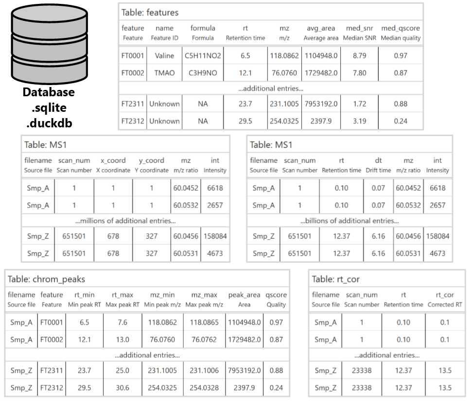
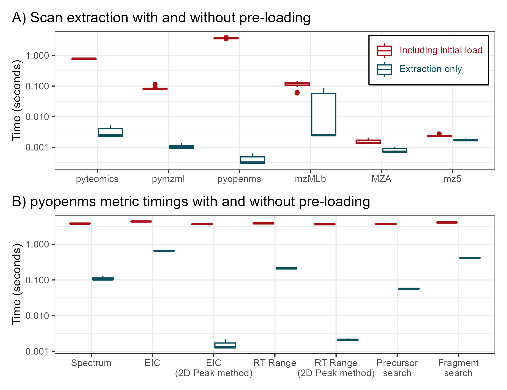
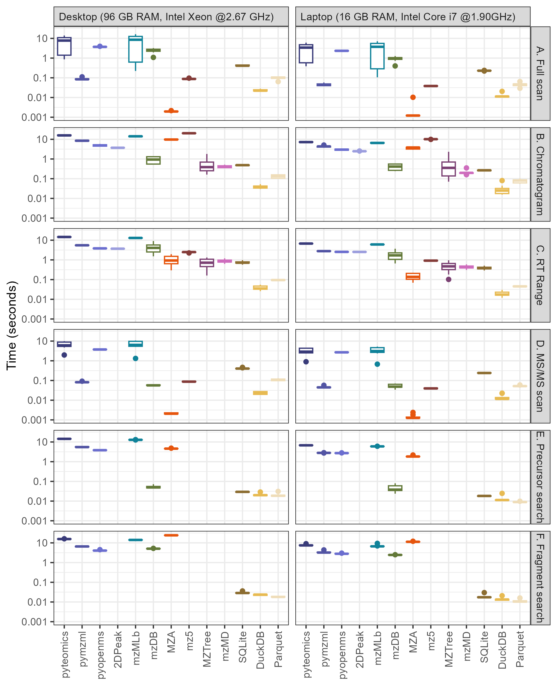
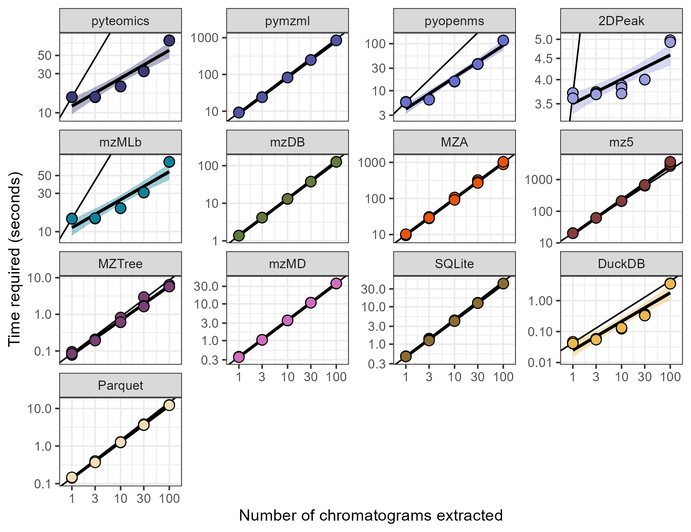
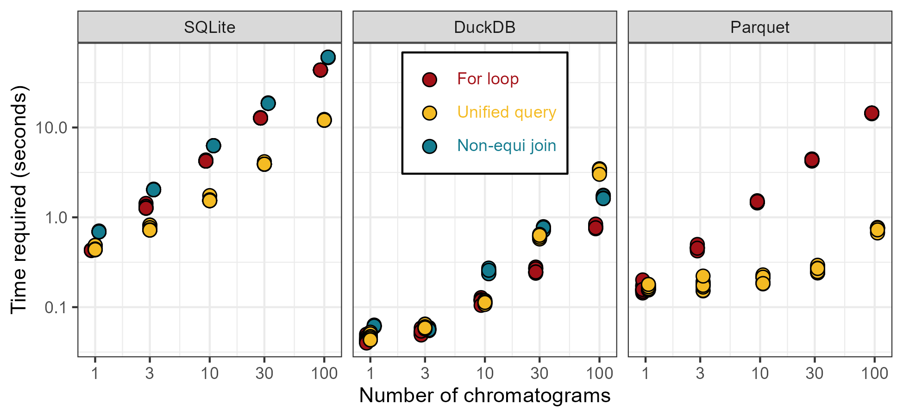

```{r setup, include=FALSE}
knitr::opts_chunk$set(echo = TRUE, include=FALSE, eval=FALSE)
```

William Kumler^1^, Sam LaRue^2^, Anitra E. Ingalls^1^* (aingalls\@uw.edu)

^1^ University of Washington, School of Oceanography, 1501 NE Boat St, Seattle, WA 98195

^2^ University of Washington, Department of Mechanical Engineering, 3900 E Stevens Way NE, Seattle, WA 98195

### Table of Contents:

  - Figure S1
  - Figure S2
  - Figure S3
  - Figure S4
  - Figure S5

\newpage

```{r supp fig 1 gtables, eval=FALSE}
library(gt)
data.frame(
  filename=c("Smp_A", "Smp_A", "Smp_Z", "Smp_Z"),
  scan_num=c(1,1,651501,651501),
  rt=c(0.10, 0.10, 12.37, 12.37),
  dt=c(0.07, 0.07, 6.16, 6.16),
  mz=c(60.0452, 60.0532, 60.0456, 60.0531),
  int=c(6618, 2657, 158084, 4673)
) %>%
  gt() %>%
  cols_label(filename=html("filename</br><small>Source file</small>"),
             scan_num=html("scan_num</br><small>Scan number</small>"),
             rt=html("rt</br><small>Retention time</small>"),
             dt=html("dt</br><small>Drift time</small>"),
             mz=html("mz</br><small><emph>m/z</emph> ratio</small>"),
             int=html("int</br><small>Intensity</small>")) %>%
  tab_row_group(label = "...billions of additional entries...", rows = rt>=mean(rt)) %>%
  tab_row_group(label = "", rows = rt<=mean(rt)) %>%
  tab_style(style = cell_text(align = "center"), locations = cells_row_groups()) %>%
  opt_table_outline() %>%
  tab_style(cell_borders(sides = c("left", "right")), locations = cells_body()) %>%
  cols_align(align = "center") %>%
  cols_move_to_start("filename") %>%
  tab_options(row_group.padding = 3) %>%
  tab_header(title = "Table: MS1") %>%
  tab_style(style = cell_text(align = "left"), locations = cells_title()) %>%
  gtsave(filename = "figures/ionmob_table.png", vwidth=1000)

data.frame(
  filename=c("Smp_A", "Smp_A", "Smp_Z", "Smp_Z"),
  scan_num=c(1,1,651501,651501),
  x_coord=c(1, 1, 678, 678),
  y_coord=c(1, 1, 327, 327),
  mz=c(60.0452, 60.0532, 60.0456, 60.0531),
  int=c(6618, 2657, 158084, 4673)
) %>%
  gt() %>%
  cols_label(filename=html("filename</br><small>Source file</small>"),
             scan_num=html("scan_num</br><small>Scan number</small>"),
             x_coord=html("x_coord</br><small>X coordinate</small>"),
             y_coord=html("y_coord</br><small>Y coordinate</small>"),
             mz=html("mz</br><small><emph>m/z</emph> ratio</small>"),
             int=html("int</br><small>Intensity</small>")) %>%
  tab_row_group(label = "...millions of additional entries...", rows = x_coord>=mean(x_coord)) %>%
  tab_row_group(label = "", rows = x_coord<=mean(x_coord)) %>%
  tab_style(style = cell_text(align = "center"), locations = cells_row_groups()) %>%
  opt_table_outline() %>%
  tab_style(cell_borders(sides = c("left", "right")), locations = cells_body()) %>%
  cols_align(align = "center") %>%
  cols_move_to_start("filename") %>%
  tab_options(row_group.padding = 3) %>%
  tab_header(title = "Table: MS1") %>%
  tab_style(style = cell_text(align = "left"), locations = cells_title()) %>%
  gtsave(filename = "figures/imaging_table.png", vwidth=1000)


data.frame(
  filename=c("Smp_A", "Smp_A", "Smp_Z", "Smp_Z"),
  scan_num=c(1,1,23338,23338),
  rt=c(0.10, 0.10, 12.37, 12.37),
  rt_cor=c(0.10, 0.10, 13.5, 13.5)
) %>%
  gt() %>%
  cols_label(filename=html("filename</br><small>Source file</small>"),
             scan_num=html("scan_num</br><small>Scan number</small>"),
             rt=html("rt</br><small>Retention time</small>"),
             rt_cor=html("rt_cor</br><small>Corrected RT</small>")) %>%
  tab_row_group(label = "...additional entries...", rows = rt>=mean(rt)) %>%
  tab_row_group(label = "", rows = rt<=mean(rt)) %>%
  tab_style(style = cell_text(align = "center"), locations = cells_row_groups()) %>%
  opt_table_outline() %>%
  tab_style(cell_borders(sides = c("left", "right")), locations = cells_body()) %>%
  cols_align(align = "center") %>%
  cols_move_to_start("filename") %>%
  tab_options(row_group.padding = 3) %>%
  tab_header(title = "Table: rt_cor") %>%
  tab_style(style = cell_text(align = "left"), locations = cells_title()) %>%
  gtsave(filename = "figures/rtcor_table.png", vwidth=1000)

data.frame(
  filename=c("Smp_A", "Smp_A", "Smp_Z", "Smp_Z"),
  feature=c("FT0001", "FT0002", "FT2311", "FT2312"),
  rt_min=c(6.5, 12.1, 23.7, 29.5),
  rt_max=c(7.6, 13.0, 25.0, 30.6),
  mz_min=c(118.0862, 76.0760, 231.1005, 254.0325),
  mz_max=c(118.0865, 76.0762, 231.1006, 254.0328),
  peak_area=c(1104948, 1729482, 7953192, 2397.9),
  quality=c(0.97, 0.87, 0.88, 0.24)
) %>%
  gt() %>%
  cols_label(filename=html("filename</br><small>Source file</small>"),
             feature=html("feature</br><small>Feature</small>"),
             rt_min=html("rt_min</br><small>Min peak RT</small>"),
             rt_max=html("rt_max</br><small>Max peak RT</small>"),
             mz_min=html("mz_min</br><small>Min peak m/z</small>"),
             mz_max=html("mz_max</br><small>Max peak m/z</small>"),
             peak_area=html("peak_area</br><small>Area</small>"),
             quality=html("qscore</br><small>Quality</small>")) %>%
  tab_row_group(label = "...additional entries...", rows = rt_min>=mean(rt_min)) %>%
  tab_row_group(label = "", rows = rt_min<=mean(rt_min)) %>%
  tab_style(style = cell_text(align = "center"), locations = cells_row_groups()) %>%
  opt_table_outline() %>%
  tab_style(cell_borders(sides = c("left", "right")), locations = cells_body()) %>%
  cols_align(align = "center") %>%
  cols_move_to_start("filename") %>%
  tab_options(row_group.padding = 3) %>%
  tab_header(title = "Table: chrom_peaks") %>%
  tab_style(style = cell_text(align = "left"), locations = cells_title()) %>%
  gtsave(filename = "figures/peak_table.png", vwidth=1000)

data.frame(
  feature=c("FT0001", "FT0002", "FT2311", "FT2312"),
  name=c("Valine", "TMAO", "Unknown", "Unknown"),
  formula=c("C5H11NO2", "C3H9NO", "NA", "NA"),
  rt=c(6.5, 12.1, 23.7, 29.5),
  mz=c(118.0862, 76.0760, 231.1005, 254.0325),
  avg_area=c(1104948, 1729482, 7953192, 2397.9),
  med_snr=c(8.79, 7.80, 1.72, 3.19),
  med_qscore=c(0.97, 0.87, 0.88, 0.24)
) %>%
  gt() %>%
  cols_label(feature=html("feature</br><small>Feature</small>"),
             name=html("name</br><small>Feature ID</small>"),
             formula=html("formula</br><small>Formula</small>"),
             rt=html("rt</br><small>Retention time</small>"),
             mz=html("mz</br><small>m/z</small>"),
             avg_area=html("avg_area</br><small>Average area</small>"),
             med_snr=html("med_snr</br><small>Median SNR</small>"),
             med_qscore=html("med_qscore</br><small>Median quality</small>")) %>%
  tab_row_group(label = "...additional entries...", rows = rt>=mean(rt)) %>%
  tab_row_group(label = "", rows = rt<=mean(rt)) %>%
  tab_style(style = cell_text(align = "center"), locations = cells_row_groups()) %>%
  opt_table_outline() %>%
  tab_style(cell_borders(sides = c("left", "right")), locations = cells_body()) %>%
  cols_align(align = "center") %>%
  cols_move_to_start("feature") %>%
  tab_options(row_group.padding = 3) %>%
  tab_header(title = "Table: features") %>%
  tab_style(style = cell_text(align = "left"), locations = cells_title()) %>%
  gtsave(filename = "figures/feature_table.png", vwidth=1000)

```



*Figure S1: Additional possible extensions to the database schema for retention time correction, feature detection and correspondence, ion mobility, and imaging.*

\newpage

```{r supp fig 2 singlefile_supp}
fun_levels = c("<span style='color:#a41118'>Including initial load</span>", 
               "<span style='color:#0b505c'>Extraction only</span>")
init_outside_gp <- read_csv("data/singlefile_supp.csv") %>%
  pivot_longer(pyteomics:mz5, names_to = "method", values_to="time") %>%
  mutate(method=factor(method, levels=method_names)) %>%
  mutate(fun_type=factor(fun_type, levels=c("inclusive", "minimal"),
                         labels=fun_levels)) %>%
  ggplot() +
  geom_boxplot(aes(x=method, y=time, color=fun_type)) +
  scale_y_log10() +
  scale_color_manual(breaks=fun_levels, values = c("#a41118", "#0b505c")) +
  labs(x=NULL, y="Time (seconds)", color=NULL) +
  theme_bw() +
  theme(legend.text=element_markdown(), legend.position = "inside",
        legend.justification.inside = c(0.98, 0.95),
        legend.background = element_rect(color='black'),
        plot.title.position = "plot", 
        plot.caption.position =  "plot") +
  ggtitle("A) Scan extraction with and without pre-loading")

pyopenms_precomp_gp <- read_csv("data/pyopenms_precomp.csv") %>%
  pivot_longer(rep1:rep3) %>%
  mutate(type=factor(type, levels=c("init", "precomp"),
                       labels=fun_levels)) %>%
  mutate(method=factor(method, levels=c("spec", "chrom", "chrom_2D", "rtrange",
                                        "rtrange_2D", "premz", "fragmz"),
                       labels = c("Spectrum", "EIC", "EIC\n(2D Peak method)",
                                  "RT Range", "RT Range\n(2D Peak method)",
                                  "Precursor\nsearch", "Fragment\nsearch"))) %>%
  ggplot() +
  geom_boxplot(aes(x=method, y=value, color=type)) +
  scale_y_log10() +
  scale_color_manual(breaks=fun_levels, values = c("#a41118", "#0b505c")) +
  theme_bw() +
  theme(legend.position = "none", 
        plot.title.position = "plot", 
        plot.caption.position =  "plot") +
  labs(x=NULL, y="Time (seconds)", color=NULL) +
  ggtitle("B) pyopenms metric timings with and without pre-loading")

supp_fig_2 <- init_outside_gp / pyopenms_precomp_gp
ggsave("figures/supp_2_preload_fig.png", plot=supp_fig_2, width = 6.5, height=5)
```



*Figure S2: Timing information with and without pre-loading the object into Python prior to extraction. Panel A) shows the number of seconds required to extract a scan for the three mzML parsers plus the mzMLb, MZA, and mz5 file types. Panel B) shows the number of seconds required for pyopenms to perform each of the queries if the initial data load was removed from the timing count. Error bars show 3x replicate queries of 5x different targets.*

\newpage

```{r supp fig 3 singlefile_laptop_ILC_comparison}
ILC_timings <- read_csv("data/singlefile_times.csv") %>% 
  # print(n=Inf)
  mutate(method=str_replace(method, "pyopenms_2DPeak", "2DPeak")) %>%
  mutate(method=factor(method, levels=method_names)) %>%
  mutate(query=factor(query, levels=c("ms1_spec", "chrom", "rtrange",
                                      "ms2_spec", "premz", "fragmz"),
                      labels=c("A. Full scan", "B. Chromatogram", "C. RT Range",
                               "D. MS/MS scan", "E. Precursor search",
                               "F. Fragment search"))) %>%
  mutate(machine="Desktop (96 GB RAM, Intel Xeon @2.67 GHz)")

laptop_timings <- read_csv("data/singlefile_times_laptop.csv") %>% 
  # print(n=Inf)
  mutate(method=str_replace(method, "pyopenms_2DPeak", "2DPeak")) %>%
  mutate(method=factor(method, levels=method_names)) %>%
  mutate(query=factor(query, levels=c("ms1_spec", "chrom", "rtrange",
                                      "ms2_spec", "premz", "fragmz"),
                      labels=c("A. Full scan", "B. Chromatogram", "C. RT Range",
                               "D. MS/MS scan", "E. Precursor search",
                               "F. Fragment search"))) %>%
  mutate(machine="Laptop (16 GB RAM, Intel Core i7 @1.90GHz)")

laptop_desktop_ratios_gp <- bind_rows(ILC_timings, laptop_timings) %>% 
  mutate(machine=c("desktop", "laptop")[as.numeric(factor(machine))]) %>%
  pivot_wider(names_from = "machine", values_from="time") %>%
  mutate(ratio=log2(desktop/laptop)) %>%
  ggplot() +
  geom_vline(xintercept = 0) +
  geom_point(aes(x=ratio, y=method, color=method)) +
  facet_wrap(~query) +
  theme_bw() +
  theme(legend.position = "none")

supp_fig_3 <- bind_rows(ILC_timings, laptop_timings) %>%
  ggplot() +
  geom_boxplot(aes(x=method, y=time, color=method)) +
  facet_grid(query~machine) +
  scale_y_log10(breaks=c(0.001, 0.01, 0.1, 1, 10), labels=as.character(c(0.001, 0.01, 0.1, 1, 10))) +
  scale_color_manual(breaks = method_names, values=method_colors) +
  labs(x=NULL, y="Time (seconds)", color=NULL) +
  theme_bw() +
  theme(axis.text.x = element_text(angle=90, hjust=1, vjust=0.5),
        legend.position = "none",
        strip.text.x = element_text(hjust = 0))

ggsave("figures/supp_3_desktop_laptop_comp.png", plot=supp_fig_3, width = 6.5, height=8)
```



*Figure S3: Comparison between an older desktop machine with 96 gigabytes (GB) of RAM and a newer desktop with 16 GB for a single DDA file. Desktop numbers are reproduced from Figure 2 using the same single file as used for the laptop. The panel rows show boxplots representing the time required in seconds to extract a full scan spectrum (A), an ion chromatogram (B), all data within a retention time range (C), an MS/MS scan (D), the fragments of a specified precursor (E), and all precursors with a specified fragment (F). The error in the boxplot is composed of timing information for 10 repeated queries for a single randomly chosen file, each of a different target scan number, retention time (RT), or m/z, just as in Figure 2.*

\newpage

```{r supp fig 4 multichrom}
multichrom_times <- read_csv("data/multichrom_times.csv")
multichrom_baseline_df <- multichrom_times %>%
  mutate(method=str_replace(method, "pyopenms_2DPeak", "2DPeak")) %>%
  filter(n_chroms==1) %>%
  summarise(time=mean(time), .by=method) %>%
  mutate(method=factor(method, levels=method_names))
supp_fig_4 <- multichrom_times %>%
  mutate(method=str_replace(method, "pyopenms_2DPeak", "2DPeak")) %>%
  mutate(method=factor(method, levels=method_names)) %>%
  ggplot(aes(x=n_chroms, y=time, color=method, fill=method)) +
  geom_abline(aes(slope=1, intercept=log10(time)), data=multichrom_baseline_df) +
  geom_smooth(method="lm", formula="y~x", color="black") +
  geom_point(position = position_dodge(width=0.1), color="black", pch=21, size=3) +
  scale_y_log10(expand=expansion(0.1)) +
  scale_x_log10(breaks=unique(multichrom_times$n_chroms), expand=expansion(0.1)) +
  scale_fill_manual(breaks = method_names, values=method_colors, 
                    aesthetics = c("fill", "color")) +
  facet_wrap(~method, scales="free_y") +
  labs(x="Number of chromatograms extracted", y="Time required (seconds)") +
  theme_bw() +
  theme(legend.position = "none")
ggsave("figures/supp_4_multichrom_facets.png", plot=supp_fig_4, width = 6.5, height=5)
```



*Figure S4: Data from main text Figure 3 with independent y-axes showing scatter plots of the time required to extract multiple chromatograms using various methods on logarithmic axes. Best-fit linear models have been added for each method and are shown behind triplicate timing measurements, while the black line shows a 1:1 slope intercepting the first data point to show nonlinear behavior with additional chromatograms. Transparent intervals around each best-fit line show a single standard error of the mean.*

\newpage

```{r supp fig 5 dbloopjoin}
type_labels = c("<span style='color:#a41118'>For loop</span>", 
               "<span style='color:#f4bb23'>Unified query</span>",
               "<span style='color:#147C8F'>Non-equi join</span>")
supp_fig_5 <- read_csv("data/dbloopjoinuni_times.csv") %>%
  separate(method, into = c("method", "type")) %>%
  mutate(type=case_when(
    type=="join"~"Non-equi join",
    type=="loop"~"For loop",
    type=="unified"~"Unified query"
  )) %>%
  mutate(type=factor(type, levels=c("For loop", "Unified query", "Non-equi join"),
                     labels=type_labels)) %>%
  mutate(method=factor(method, levels=c("sqlite", "duckdb", "parquet"),
                       labels=c("SQLite", "DuckDB", "Parquet"))) %>%
  ggplot(aes(x=n_chroms, y=time, fill=type)) +
  geom_point(position=position_dodge(width = 0.1), color="black", size=3, pch=21) +
  facet_wrap(~method, nrow=1) +
  scale_y_log10() +
  scale_x_log10(breaks=c(1, 3, 10, 30, 100)) +
  scale_fill_manual(breaks=type_labels, values = c("#a41118", "#f4bb23", "#147C8F")) +
  labs(x="Number of chromatograms", y="Time required (seconds)", fill=NULL) +
  theme_bw() +
  theme(legend.position = "inside", legend.justification.inside = c(0.5, 0.95),
        legend.background = element_rect(color='black'),
        legend.text=element_markdown(),
        plot.title.position = "plot", 
        plot.caption.position =  "plot")
ggsave("figures/supp_5_dbloopjoinuni.png", plot=supp_fig_5, width = 6.5, height=3)
```



*Figure S5: Scatter plot showing time required to extract chromatograms from SQLite, DuckDB, and Parquet databases using different methods denoted by color. Ten replicates are shown for each data point.*
